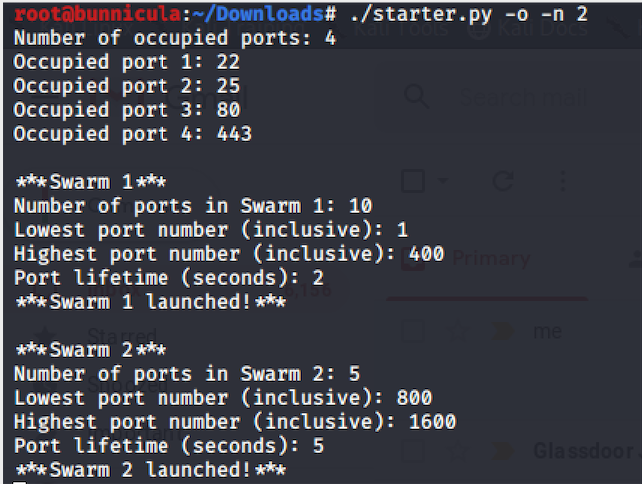

# Swarmer
> A command-line tool for creating ephemeral server swarms

Swarmer launches and maintains a random swarm of decoy servers. These "will-o'-the-wisp" servers jump around continuously over a given portnumber space at regular intervals; they are intended to confuse and mislead network scanners (such as nmap).

## Usage example

Running the starter.py on the command line instantiates a server swarm:

> ./starter

The -o ("occupied") and -n ("number") switches can be used to indicate ports that are already in use and to launch multiple server swarms with distinct parameters. Using either of these switches will prompt the tool to solicit user input:

> ./starter -o -n 3

 

## Meta

Patrick Kelly – patrickyunen@gmail.com

